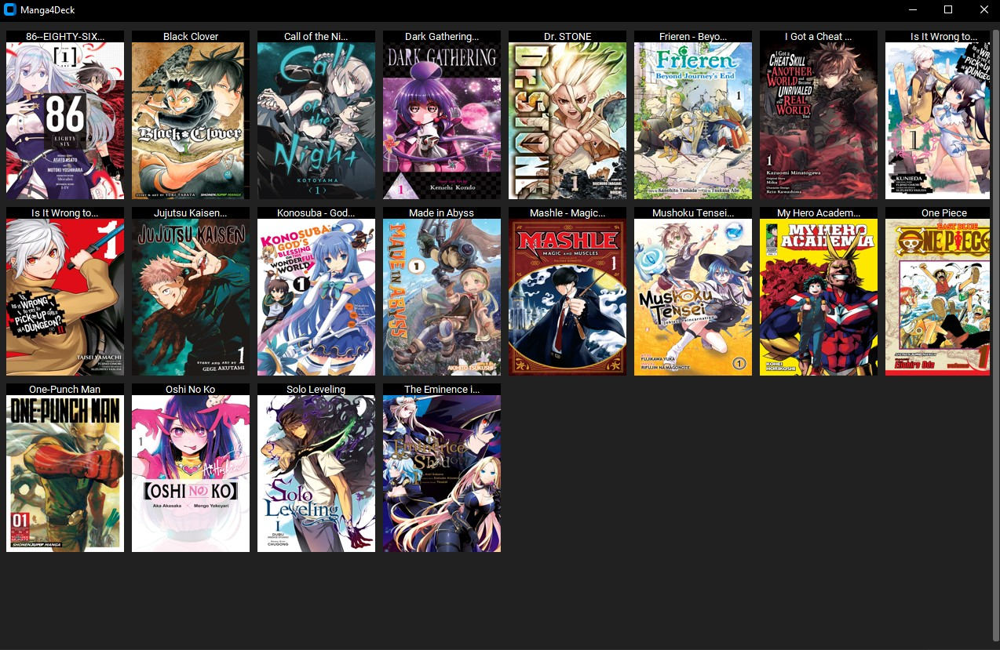
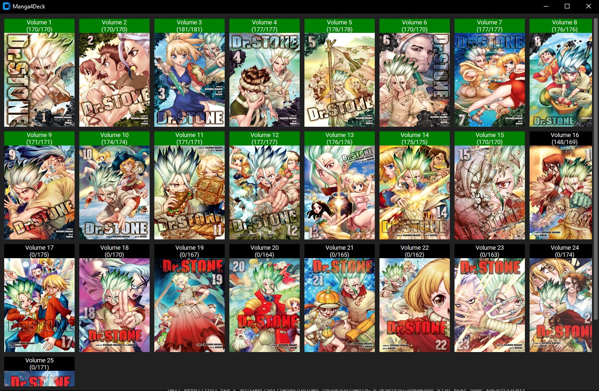

manga4deck
==========

Reader for SteamDeck, developing only for reading manga using Kavita selfhosted server

<a name="download" href="https://raw.githubusercontent.com/boddicheg/manga4deck/main/installer.desktop">Download .desktop</a>

Screenshots:
----



Steam Deck mappings:
----
Buttons:
- (A) - Keyboard -> Enter 
- (B) - Keyboard -> Backspace 
- (X) - Keyboard -> 'F2' - bind for caching manga serie, works only on manga volumes page 
- (Y) - Keyboard -> 'F1' - set focused volume as completed

Cross:
- (<) - Keboard -> Left Arrow 
- (>) - Keboard -> Rigth Arrow 
- (^) - Keboard -> Up Arrow 
- (v) - Keboard -> Down Arrow 


Deps
----
```
sudo apt-get install python3-pil python3-pil.imagetk
sudo apt-get install python3-tk
```
mac
```
brew install python-tk
```
