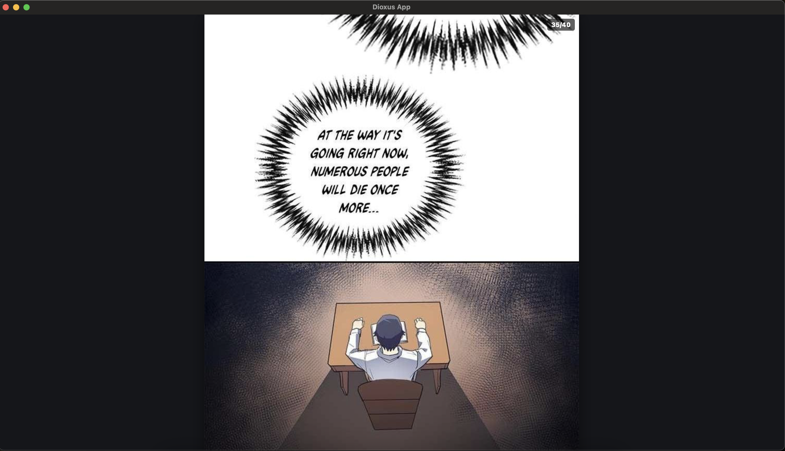

# Manga4Deck

Manga4Deck is a manga and manhwa reader for Steam Deck, built for a self-hosted Kavita server.

The app has a Rust backend and a native Manga4Deck UI focused on Steam Deck use.

## Screenshots





## Features

- Steam Deck friendly shelf UI
- Kavita library, series, volume, and page browsing
- Offline/cache-aware volume and series state
- Cover thumbnails cached as small JPEGs for faster shelf loading
- Reader with batch page loading
- Keyboard and Steam Deck controller friendly navigation

## Controls

Recommended Steam Deck keyboard mappings:

| Action | Key |
| --- | --- |
| Activate selected tile | Enter |
| Go back | Backspace |
| Move selection on shelves | Arrow keys |
| Scroll reader | Up / Down |
| Show and move reader page slider | Left / Right |

Reader behavior:

- Up and Down scroll the page.
- First Left or Right press shows the page slider.
- While the slider is visible, Left and Right change the selected page.
- The slider hides 5 seconds after the last Left or Right press.

## Development

### Requirements

- Rust and Cargo
- Node.js LTS and npm
- Linux packages required by the native UI stack, for example on Ubuntu:

```bash
sudo apt-get update
sudo apt-get install -y \
  build-essential \
  libayatana-appindicator3-dev \
  librsvg2-dev \
  libssl-dev \
  libwebkit2gtk-4.1-dev \
  libxdo-dev \
  patchelf \
  pkg-config
```

### Install dependencies

```bash
npm ci
```

### Run Manga4Deck

```bash
npm run manga4deck
```

This starts the Rust backend HTTP API and launches the native Manga4Deck UI.

### Build/check

Check the Manga4Deck build:

```bash
cargo check --manifest-path src/Cargo.toml
```

Build the Manga4Deck binary:

```bash
cargo build --manifest-path src/Cargo.toml
```

## Kavita

Manga4Deck expects access to a Kavita server. Server IP, username/password, and API key are stored by the app settings UI.

The local backend listens on:

```text
0.0.0.0:11337
```
